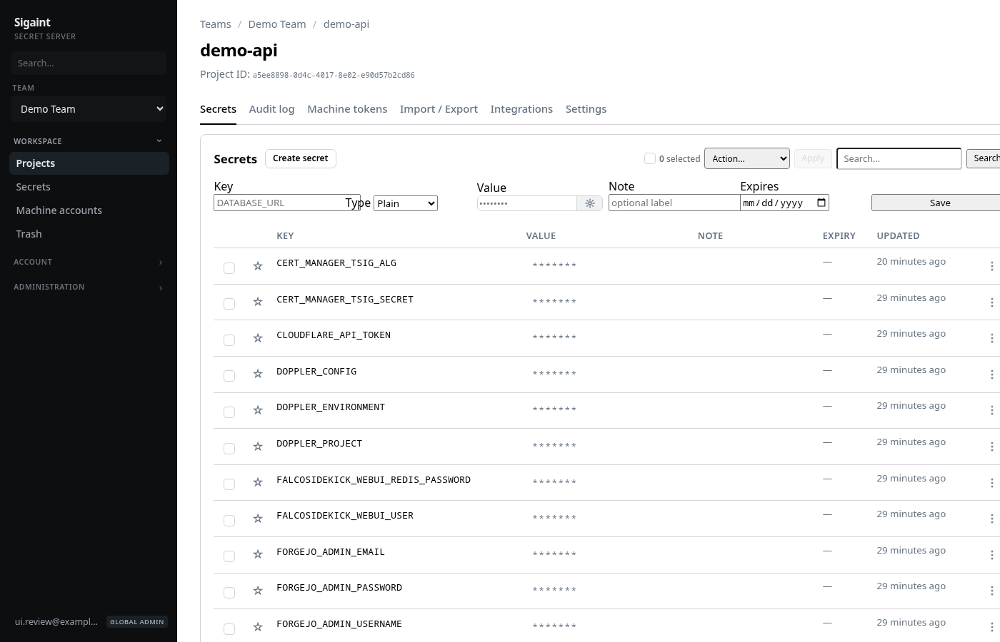
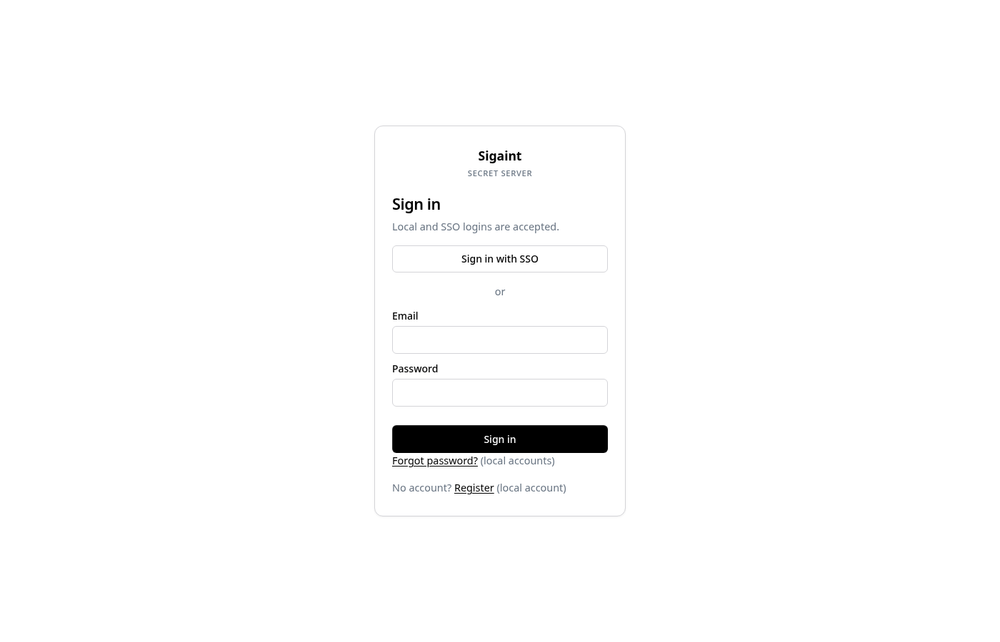
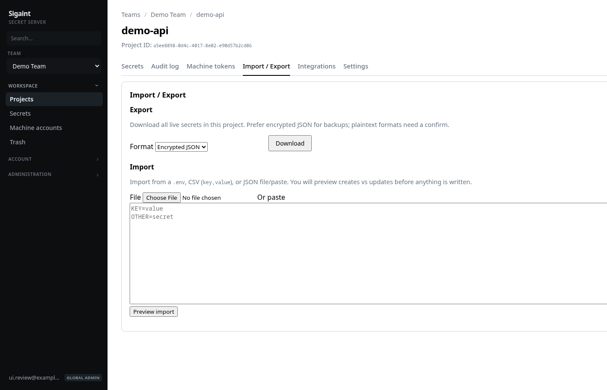
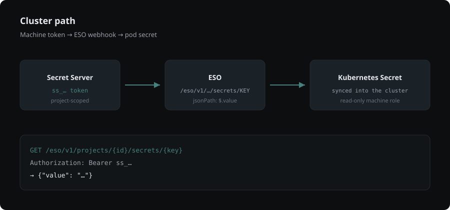

# Sigaint Secret Server

Team secrets for people and platforms — projects, membership, browser UI, and OpenShift ESO.

<p align="center">
  
</p>

Values are encrypted at rest (`MASTER_KEY`). Access is enforced in **Postgres RLS**, not only the app.

## Features

| | |
|---|---|
| **Teams → projects → secrets** | plain, database URL, certificate, SSH, KV |
| **Browser UI** | reveal/copy, history, trash, bulk actions, import/export |
| **ESO / machines** | project-scoped `ss_…` tokens for External Secrets Operator |
| **Scripts** | personal access tokens `pat_…` → short-lived JWT → PostgREST |
| **Identity** | local login, optional LDAP / OIDC, optional TOTP |
| **Ops** | audit export + retention purge |

<p align="center">
  
  &nbsp;
  
</p>

## Quick start

```bash
export GLOBAL_ADMIN_EMAIL=you@example.com
ALLOW_INSECURE_DEFAULTS=1 podman-compose up -d --build
# UI → http://localhost:8080  (register as you@example.com)
```

Production: set strong `JWT_SECRET`, `MASTER_KEY`, `SECRET_KEY` and leave `ALLOW_INSECURE_DEFAULTS` off. Full env list: [docs/deploy.md](docs/deploy.md).

## Roles (essentials)

| Who | Can do |
|-----|--------|
| Team owner / admin | Manage team, projects, secrets |
| Team member | Write secrets (default); create projects |
| Team viewer | Read only |
| Project role | **Overrides** team default on that project |
| Global admin | Settings, all teams, audit |
| Machine `ss_…` | ESO fetch (`read-only`) or upsert (`write`) |
| User `pat_…` | Same as that user via JWT / PostgREST |

## Cluster path (ESO)

<p align="center">
  
</p>

```bash
# Prefer a read-only machine token on the project
curl -H "Authorization: Bearer ss_…" \
  "https://secrets.example.com/eso/v1/projects/{id}/secrets/DATABASE_URL"
# → {"value":"…"}   # ESO jsonPath: $.value
```

Sample manifests: [docs/openshift-eso.yaml](docs/openshift-eso.yaml).

## Docs

| | |
|---|---|
| [docs/deploy.md](docs/deploy.md) | Env, bootstrap, OIDC/LDAP, audit purge |
| [docs/api.md](docs/api.md) | HTTP, PAT, ESO, PostgREST |
| [docs/postgrest-openapi.json](docs/postgrest-openapi.json) | PostgREST OpenAPI snapshot |

## Not this

Not a personal password manager, full PAM, or multi-cloud secrets fabric. Focused secrets server for org teams and OpenShift-style consumers.
