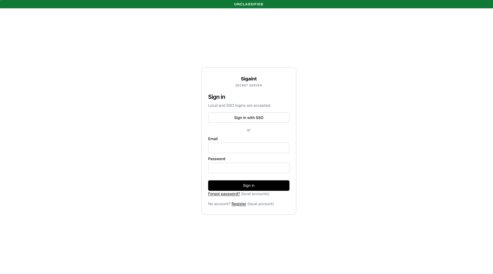
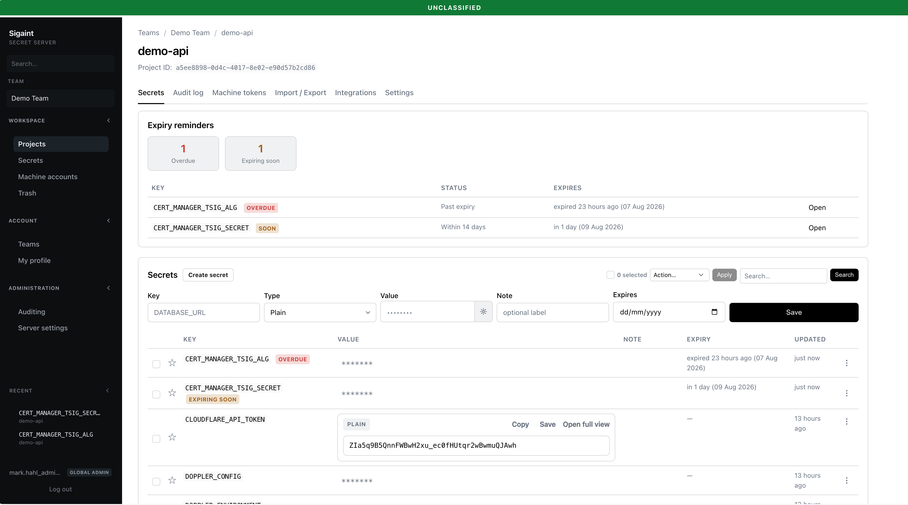
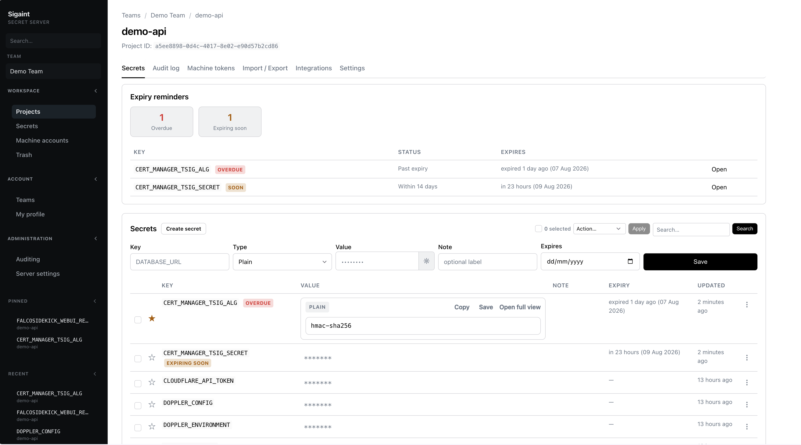
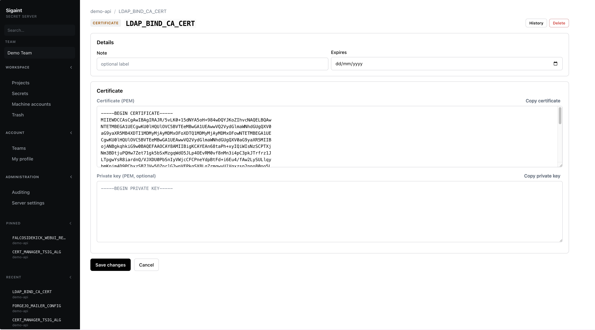
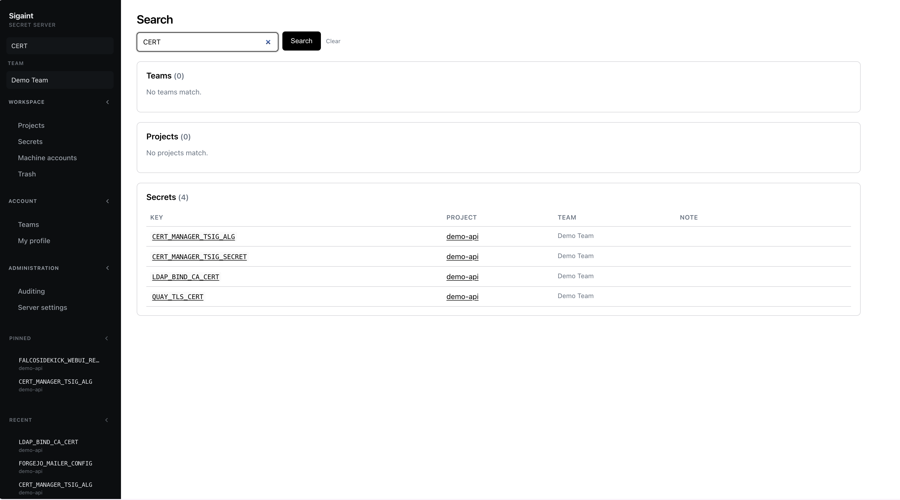
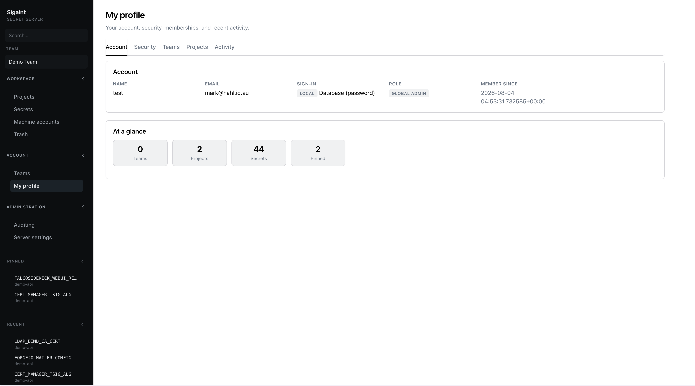
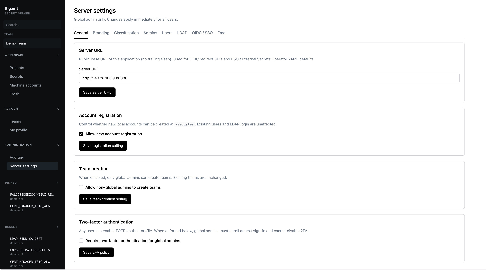
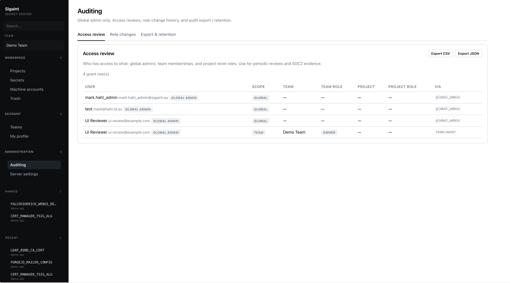

# Sigaint Secret Server

A small **team secrets store** for people and platforms — team → project →
key/value secrets with Postgres RLS enforcement, a browser UI (Flask + HTMX),
OpenShift External Secrets Operator (ESO) webhooks, and PostgREST for API
clients. Values are encrypted at rest with `MASTER_KEY`.

## Quick start

```bash
export GLOBAL_ADMIN_EMAIL=you@example.com
ALLOW_INSECURE_DEFAULTS=1 podman-compose up -d --build
# UI: http://localhost:8080 — register as you@example.com
```

See [docs/deploy.md](docs/deploy.md) for production setup (strong secrets,
OIDC/LDAP, audit retention).

## Documentation

| Doc | Contents |
|-----|----------|
| **[docs/deploy.md](docs/deploy.md)** | Deploy, env vars, bootstrap, OIDC/LDAP, audit purge |
| **[docs/authentication.md](docs/authentication.md)** | Every auth flow (session, PAT, machine, JWT, OIDC, LDAP) + curl examples |
| **[docs/building.md](docs/building.md)** | Build & push the app container image (Docker/Podman/OpenShift) |
| **[docs/api.md](docs/api.md)** | HTTP / machine / PAT / PostgREST API reference |
| **[docs/openshift-eso.yaml](docs/openshift-eso.yaml)** | Sample SecretStore + ExternalSecret |
| **[docs/openshift-purge-audit-cronjob.yaml](docs/openshift-purge-audit-cronjob.yaml)** | Daily audit retention CronJob |

## Features

| Feature | Description |
|---------|-------------|
| Team → project → secret store | Organise secrets as **team → project → key/value** |
| Structured secret kinds | Plain, database URL, certificate (PEM), SSH key, key/value pairs |
| Browser UI (Flask + HTMX) | Bulk actions, trash, version history, search, pins |
| Postgres RLS enforcement | Access control at the database, not just the app |
| PostgREST API | SQL-style API with JWT auth for clients |
| ESO / machine tokens | Project-scoped `ss_…` webhook for OpenShift ESO & CI |
| Personal access tokens | `pat_…` for scripts → short-lived PostgREST JWT |
| TOTP 2FA | Per-user 2FA with single-use recovery codes |
| LDAP & OIDC / SSO | Group → team role / global-admin maps |
| SMTP | Password-reset emails and login alerts |
| Auditing | Secret & org audit logs, access review, export, retention purge |
| Secret expiry | Optional per-secret expiry with overdue/soon dashboard |
| Import / export | `.env`, JSON, CSV bulk import and export with audit trail |
| Classification banner | Optional per-server / per-team banner (e.g. OFFICIAL) |
| Server-side sessions | Multi-device sign-out and per-session revocation |
| Login lockout | 5 failed attempts → 5 minute lockout |

## Screenshots


















## License

[GNU Affero General Public License v3.0](LICENSE) (AGPL-3.0).
